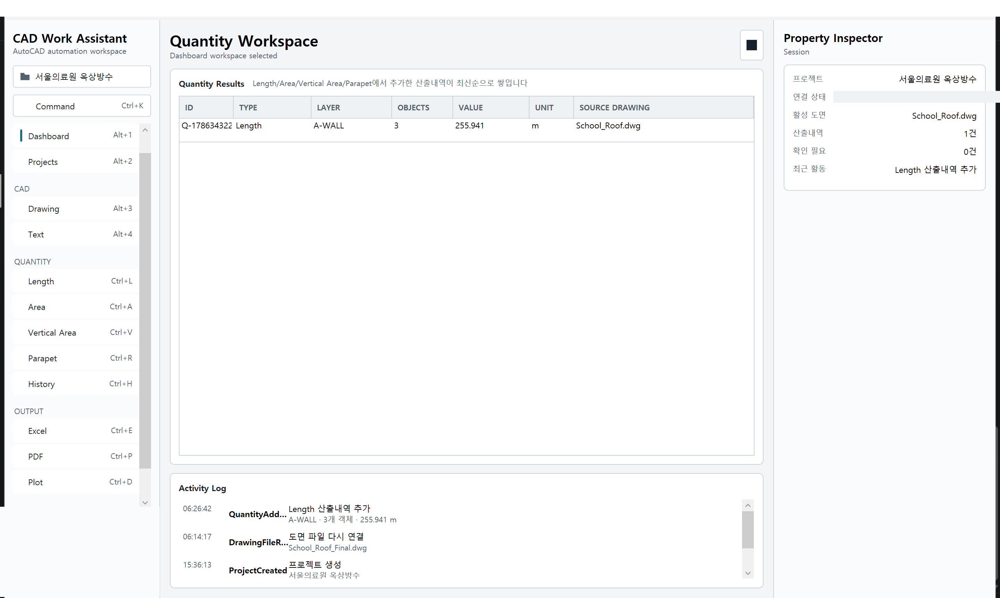
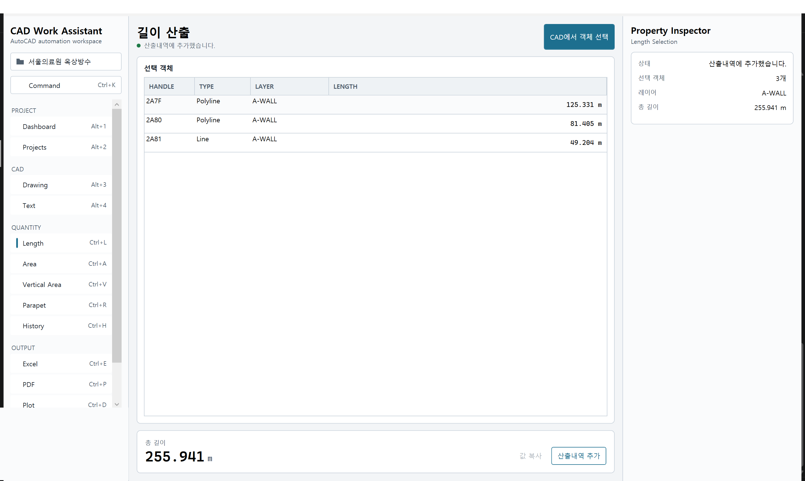
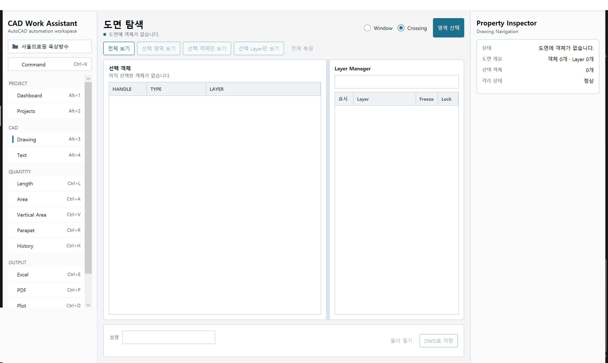
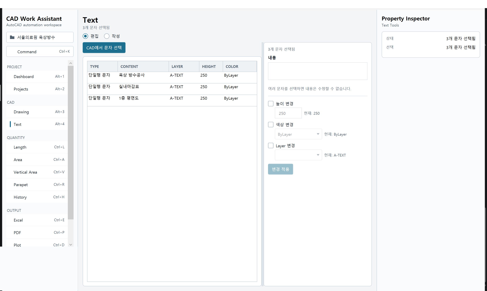
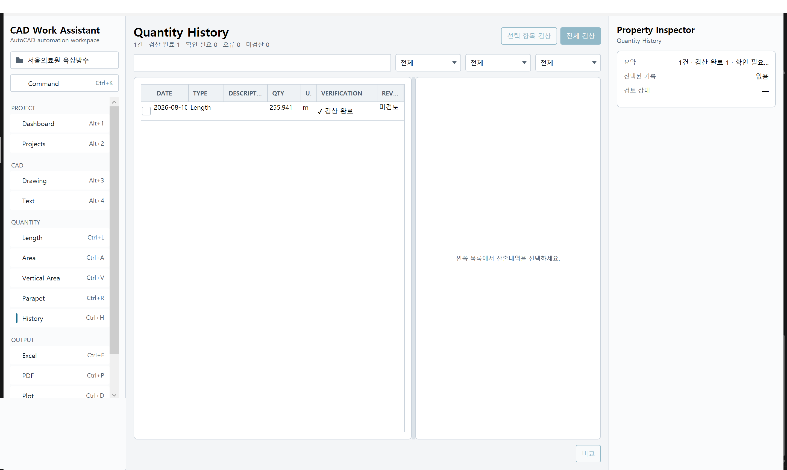
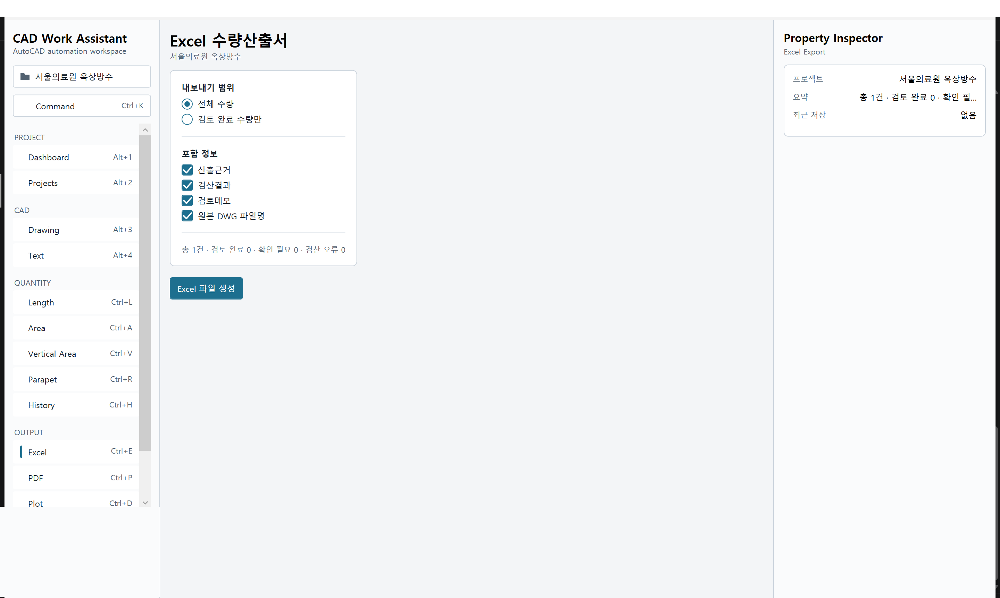
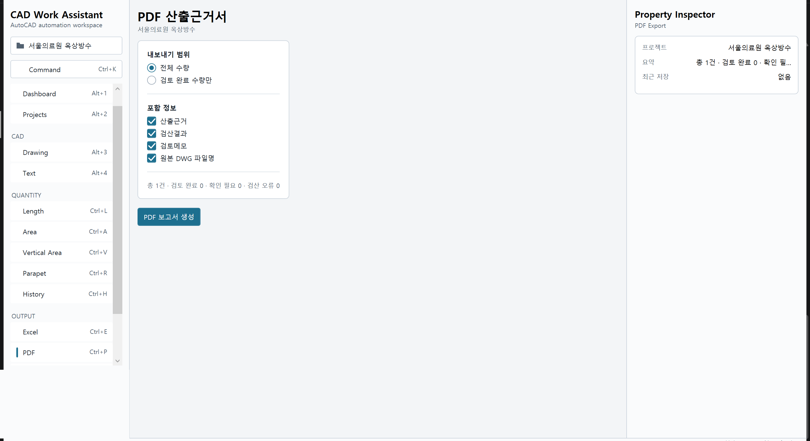
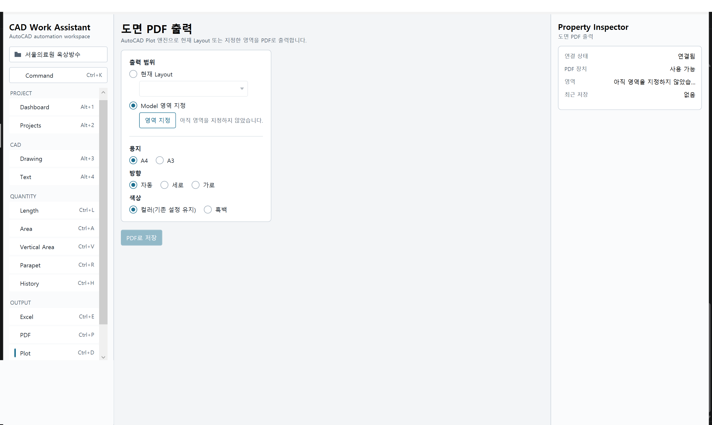
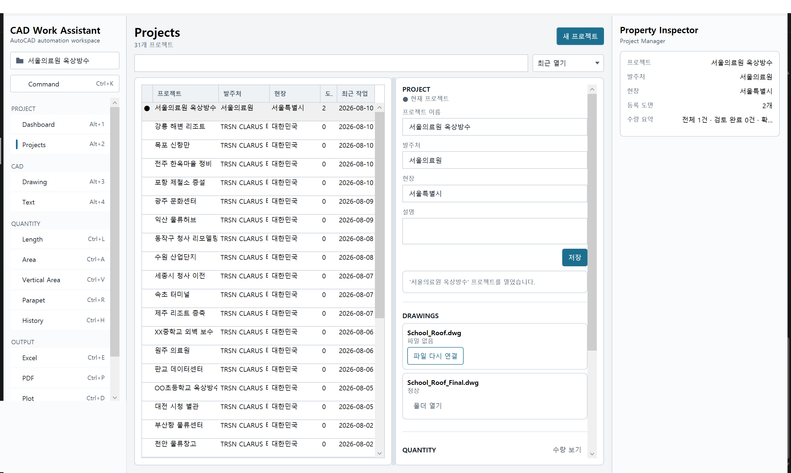
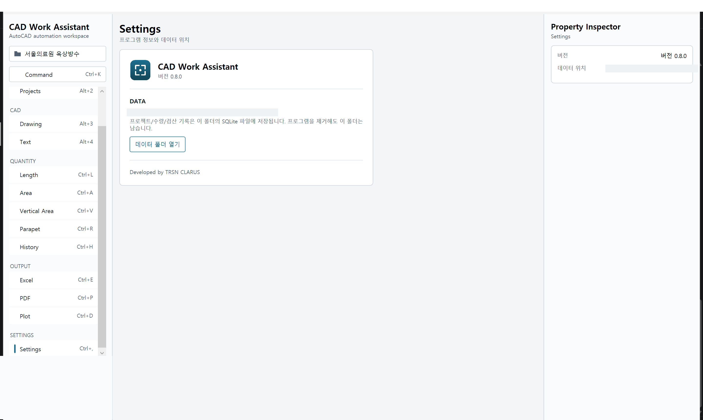

# CAD Work Assistant
## 사용설명서

AutoCAD 도면 측정 · 수량 산출 · 검산 · 출력 업무 가이드

---

# 목차

1. CAD Work Assistant 소개
2. 설치 및 실행
3. 화면 구성
4. 프로젝트 관리
5. AutoCAD 연결
6. 길이 측정
7. 면적 측정
8. 수직면적 계산
9. 파라펫 계산
10. 도면 탐색 및 객체 선택
11. Layer 관리
12. 선택 객체 DWG 저장
13. Text Tools
14. 수량산출표
15. 수량 이력 및 검산
16. Excel 수량산출서
17. PDF 산출근거서
18. 도면 PDF 출력
19. 프로젝트 파일 관리
20. Settings
21. 데이터 저장 및 백업
22. 문제 해결
23. 단축키
24. 용어 정리

---

# 1. CAD Work Assistant 소개

CAD Work Assistant는 AutoCAD로 작업하는 실무자를 위한 Windows 설치형 업무 자동화 프로그램입니다.
도면을 확인하고, 객체를 선택해 길이·면적·수량을 산출하고, 필요한 부분만 별도 파일로 뽑아내고,
결과를 Excel/PDF 문서로 정리하는 과정을 하나의 프로그램에서 처리합니다.

CAD Work Assistant는 AutoCAD를 대체하지 않습니다. 도면을 그리거나 편집하는 작업은 여전히
AutoCAD에서 합니다. CAD Work Assistant는 AutoCAD와 나란히 실행되면서, AutoCAD에서 선택한
객체의 정보를 읽어와 계산·정리·문서화하는 역할을 합니다.

## 핵심 작업 흐름

```
프로젝트 만들기
      │
      ▼
AutoCAD에서 도면 열기
      │
      ▼
CAD Work Assistant에서 측정(길이/면적 등)
      │
      ▼
수량산출표에 저장
      │
      ▼
필요하면 검산(자동 확인)
      │
      ▼
Excel 또는 PDF로 출력
```

## 인터넷 연결이 필요 없습니다

CAD Work Assistant는 인터넷 연결이나 AI/LLM 서비스 없이 로컬 PC에서 완전히 동작합니다. 모든
계산과 문서 생성은 이 PC 안에서 이루어지며, 프로젝트 데이터도 이 PC에만 저장됩니다.

## AutoCAD 없이도 쓸 수 있는 기능

AutoCAD가 실행되어 있지 않아도 프로젝트 목록 확인, 저장된 수량 이력 조회, Excel/PDF 문서 재확인
같은 기능은 계속 쓸 수 있습니다. 도면에서 직접 객체를 선택하거나 측정하는 기능만 AutoCAD 연결이
필요합니다.

---

# 2. 설치 및 실행

1. 배포받은 `CADWorkAssistant-Setup-x.y.z-x64.exe` 설치 파일을 실행합니다.
2. 설치 마법사의 안내에 따라 진행합니다. 관리자 권한이 필요하지 않습니다 - 현재 로그인한
   사용자 계정에만 설치됩니다.
3. 설치가 끝나면 시작 메뉴에서 "CAD Work Assistant"를 찾아 실행합니다.

설치 과정에서 AutoCAD 연동에 필요한 구성 요소도 함께 설치됩니다. AutoCAD가 설치되어 있다면
다음에 AutoCAD를 실행할 때 별도 조작 없이 자동으로 CAD Work Assistant Plugin이 로드됩니다.

## Windows SmartScreen 경고

설치 파일이 별도 인증서로 서명되어 있지 않아 "Windows에서 PC를 보호했습니다" 같은 SmartScreen
경고가 뜰 수 있습니다. "추가 정보"를 클릭한 뒤 "실행"을 눌러 계속 진행하면 됩니다.

## 재설치 / 업그레이드

새 버전의 Setup 파일을 그대로 실행하면 기존 설치 위치를 기억해 자동으로 덮어씁니다. 프로젝트
데이터는 설치 폴더가 아닌 별도 위치에 저장되므로, 재설치해도 기존 프로젝트/수량 기록은 그대로
남습니다.

---

# 3. 화면 구성

CAD Work Assistant를 실행하면 다음과 같은 화면이 나타납니다.



- **① 왼쪽 사이드바** - 현재 프로젝트, 명령 검색(Command), 기능 목록(PROJECT/CAD/QUANTITY/
  OUTPUT/SETTINGS 그룹), 하단에 AutoCAD 연결 상태가 표시됩니다.
- **② 중앙 작업 영역** - 지금 선택한 기능의 실제 작업 화면입니다.
- **③ 오른쪽 Property Inspector** - 지금 화면에서 중요한 값들을 한눈에 요약해서 보여줍니다.
  Inspector 토글 버튼으로 접었다 펼 수 있습니다.

기능은 왼쪽 목록을 클릭하거나 단축키로 전환합니다(자세한 단축키는 23장 참고).

---

# 4. 프로젝트 관리

프로젝트는 하나의 공사/현장 단위로 측정값·도면·출력물을 모아두는 단위입니다.

## 빠른 세션

프로젝트를 만들지 않고도 길이/면적 측정은 바로 시작할 수 있습니다. 이 상태를 "빠른 세션"이라고
부르며, 사이드바 상단에 "빠른 세션 (프로젝트 없음)"으로 표시됩니다. 빠른 세션에서 측정한 값은
화면에는 보이지만 프로그램을 닫으면 사라집니다 - 나중에 다시 찾아볼 값이라면 먼저 프로젝트를
만드는 것을 권장합니다.

## 새 프로젝트 만들기

1. 사이드바 상단의 프로젝트 버튼(현재 "빠른 세션 (프로젝트 없음)"이라고 적힌 부분)을 클릭합니다.
2. "프로젝트 이름"을 입력합니다(필수). "발주처", "현장", "설명"은 선택 입력입니다.
3. "프로젝트 만들기"를 누릅니다.

프로젝트를 만들면 자동으로 그 프로젝트가 현재 프로젝트로 열립니다.

## 기존 프로젝트 열기 (빠른 전환)

같은 대화상자 아래쪽 "최근 프로젝트" 목록에서 원하는 프로젝트를 클릭하면 바로 전환됩니다. 최근
연 순서대로 표시됩니다.

프로젝트가 많아 찾기 어렵다면 19장 "프로젝트 파일 관리"의 Projects 화면을 이용하세요.

## 저장은 자동입니다

CAD Work Assistant에는 별도의 "저장" 버튼이 없습니다. 프로젝트를 만들거나, 산출내역을
추가하거나, 문서를 출력하는 등 모든 작업은 그 즉시 저장됩니다.

---

# 5. AutoCAD 연결

CAD Work Assistant는 AutoCAD와 별도 프로그램으로 실행되며, AutoCAD가 실행되어 있을 때
자동으로 연결됩니다.

## 연결 상태 확인

사이드바 하단에 현재 연결 상태가 표시됩니다.

| 표시 | 의미 |
|---|---|
| AutoCAD Not Running | AutoCAD가 실행되어 있지 않음 |
| AutoCAD Detected · Plugin Not Loaded | AutoCAD는 실행 중이나 아직 연동되지 않음 |
| Connecting… | 연결 시도 중 |
| {제품명} Connected | 정상 연결됨 - 도면 작업 가능 |
| Reconnecting… | 일시적으로 끊겨 재연결 시도 중 |
| AutoCAD Disconnected | 연결이 끊김 |

## 연결되면 무엇이 보이나요

정상 연결되면 사이드바에 현재 열려 있는 도면 이름과 도면 단위(mm/cm/m 등)가 함께 표시됩니다.
AutoCAD에서 다른 도면으로 전환하면 이 표시도 자동으로 갱신됩니다.

## 연결이 안 될 때

- AutoCAD가 실행되어 있는지 확인합니다.
- AutoCAD를 처음 실행한 직후라면 연동 준비에 몇 초 걸릴 수 있습니다.
- 그래도 연결되지 않으면 22장 "문제 해결"을 참고하세요.

---

# 6. 길이 측정

왼쪽 메뉴 QUANTITY 그룹의 **Length**에서 선(Line), 폴리선(Polyline), 호(Arc) 등의 길이를
계산합니다.



## 사용 방법

1. **Length** 화면으로 이동합니다(단축키 Ctrl+L).
2. **[CAD에서 객체 선택]**을 누릅니다.
3. AutoCAD 창으로 자동 전환되며, 마우스로 길이를 계산할 객체를 선택합니다(여러 개 동시 선택
   가능). 선택을 마쳤으면 Enter를 누릅니다.
4. CAD Work Assistant로 돌아오면 선택한 객체들의 총 길이가 자동으로 계산되어 표시됩니다.

## 결과 확인

- 도면 단위가 mm/cm 등이어도 자동으로 m 단위로 환산되어 표시됩니다.
- 선택한 객체 중 길이 계산이 불가능한 형식(예: Hatch)이 섞여 있으면, 몇 개가 제외되었는지
  화면에 안내됩니다 - 프로그램이 멈추지 않습니다.
- 도면이 "단위 없음(Unitless)"으로 설정된 경우 자동 환산을 하지 않고 그 사실을 명확히
  안내합니다.

## 산출내역에 추가

결과가 마음에 들면 **[산출내역 추가]**를 눌러 14장의 수량산출표에 저장합니다. **[값 복사]**로
숫자만 클립보드에 복사할 수도 있습니다.

## 선택을 취소하고 싶다면

AutoCAD에서 객체를 선택하는 중 Esc를 누르면 아무 일도 일어나지 않고 원래 화면으로 돌아옵니다 -
오류가 아닙니다.

---

# 7. 면적 측정

QUANTITY 그룹의 **Area**에서 닫힌 도형(Polyline, Circle, Ellipse, Region 등)의 면적을
계산합니다. 사용 방법은 6장 Length와 동일합니다 - **[CAD에서 객체 선택]** → AutoCAD에서 도형
선택 → 결과 확인 → **[산출내역 추가]**.

## 주의사항

- 선택한 도형이 닫혀 있지 않으면(선이 끊겨 있으면) 정확한 면적을 계산할 수 없습니다 - 이 경우
  화면에 안내가 표시되고 저장이 제한됩니다.
- 면적이 사실상 0에 가까운 형상은 실무적으로 의미가 없다고 보아 저장 버튼이 비활성화됩니다.

---

# 8. 수직면적 계산

QUANTITY 그룹의 **Vertical Area**는 "기준 길이 × 높이"로 벽면·입면 등의 수직 면적을 계산합니다.
길이를 다시 재는 대신 이미 측정한 값을 재사용할 수 있습니다.

## 기준 길이 선택 방법 3가지

1. **CAD에서 새로 선택** - AutoCAD에서 기준이 될 선을 다시 선택합니다.
2. **최근 측정값 사용** - 방금 Length에서 측정한 값을 그대로 가져옵니다(같은 세션 안에서만
   가능).
3. **직접 입력** - 길이 값을 숫자로 직접 입력합니다.

## 사용 방법

1. 위 3가지 중 한 가지 방법으로 기준 길이를 정합니다.
2. **높이**를 입력하고 단위를 선택합니다(mm/m 등).
3. 결과(기준 길이 × 높이)가 실시간으로 계산되어 표시됩니다 - 버튼을 누르지 않아도 입력할
   때마다 바로 갱신됩니다.
4. **[산출내역 추가]**로 저장합니다.

예시: 기준 길이 255.941 m, 높이 0.100 m → 수직면적 25.594 m²

---

# 9. 파라펫 계산

QUANTITY 그룹의 **Parapet**은 8장 수직면적과 같은 "기준 길이 × 높이" 방식이되, 옥상 파라펫처럼
한 면 또는 양면, 상부면 포함 여부를 함께 계산합니다.

## 사용 방법

1. 8장과 같은 방법으로 기준 길이(보통 파라펫 둘레)를 정합니다.
2. **높이**를 입력합니다.
3. **면**에서 "한 면" 또는 "양면"을 선택합니다.
4. 필요하면 **상부면 포함**을 체크하고 상부 폭을 입력합니다.
5. 측면/상부/총 면적이 각각 계산되어 표시됩니다.
6. **[산출내역 추가]**로 저장합니다.

## 주의사항

- **양면 계산은 동일한 기준 길이를 양쪽 면에 그대로 적용합니다.** 벽 두께 때문에 실제 안쪽과
  바깥쪽 둘레가 다르다면, 이 프로그램은 그 차이를 자동으로 반영하지 않습니다 - 정밀한 계산이
  필요하면 안쪽/바깥쪽을 각각 별도로 측정해 더하는 방식을 권장합니다.

---

# 10. 도면 탐색 및 객체 선택

CAD 그룹의 **Drawing**에서 도면을 둘러보고 원하는 객체만 남겨서 볼 수 있습니다.



## 화면 보기

- **[전체 보기]** - 도면 전체가 보이도록 화면을 맞춥니다.
- **[영역 선택]** → AutoCAD에서 두 점으로 사각형 영역 지정(Window/Crossing 방식 선택 가능) →
  **[선택 영역 보기]**로 그 영역만 확대해서 봅니다.

## 객체 격리(Isolate)

작업 중인 객체나 Layer만 남기고 나머지를 숨기고 싶을 때 사용합니다.

1. AutoCAD에서 남기고 싶은 객체를 선택합니다.
2. **[선택 객체만 보기]**(선택한 객체만 남기고 나머지 숨김) 또는 **[선택 Layer만 보기]**(선택한
   객체가 속한 Layer 전체를 남기고 나머지 숨김) 중 하나를 누릅니다.
3. 작업이 끝나면 **[전체 복원]**을 눌러 원래 상태로 되돌립니다.

격리는 화면에 무엇을 보여줄지만 바꿀 뿐, 도면 파일 자체를 바꾸지 않습니다.

---

# 11. Layer 관리

Drawing 화면 안에 Layer 목록이 함께 표시됩니다. Layer 이름으로 검색할 수 있고, "표시" 칸의
체크박스로 각 Layer를 켜고 끌 수 있습니다.

Layer를 껐다가 다시 켜면(또는 [전체 복원]을 누르면) 원래 표시 상태로 정확히 되돌아갑니다 -
어떤 Layer가 원래 켜져 있었는지를 CAD Work Assistant가 기억하기 때문입니다.

---

# 12. 선택 객체 DWG 저장

Drawing 화면 하단에서 지금 선택한 객체만 별도의 새 DWG 파일로 저장할 수 있습니다(예: 특정
공종 부분만 협력업체에 전달할 때).

1. AutoCAD에서 저장하고 싶은 객체를 선택합니다.
2. 필요하면 "Export 설명"에 메모를 남깁니다.
3. **[DWG로 저장]**을 누르고 저장 위치를 지정합니다.
4. 저장이 끝나면 **[폴더 열기]**로 바로 확인할 수 있습니다.

**원본 도면은 전혀 바뀌지 않습니다.** 선택한 객체를 복사해 새 파일에 담을 뿐입니다.

---

# 13. Text Tools

CAD 그룹의 **Text**에서 도면의 문자(단일행 문자/여러행 문자)를 조회하고 값을 바꾸거나, 새 문자를
만듭니다.



지원하는 문자 종류는 **단일행 문자**와 **여러행 문자** 두 가지입니다. 치수 문자(Dimension),
지시선(MLeader), 표(Table) 등은 지원하지 않으며 선택 시 "지원되지 않는 문자 객체"로 안내되고
자동으로 제외됩니다.

## 문자 편집

1. 화면 상단에서 **편집** 모드를 선택합니다.
2. **[CAD에서 문자 선택]**으로 AutoCAD에서 문자를 선택합니다.
3. 목록에서 바꾸고 싶은 항목을 확인합니다.
4. 오른쪽에서 바꿀 항목만 체크합니다 - **높이 변경**, **색상 변경**, **Layer 변경** 각각 체크한
   항목만 실제로 바뀝니다. 체크하지 않은 속성은 그대로 유지됩니다.
5. 내용(문구)은 문자 하나를 선택했을 때만 수정할 수 있습니다(여러 개를 한 번에 같은 내용으로
   덮어쓰는 실수를 막기 위함입니다).
6. **[문자 변경 적용]**을 누릅니다.

여러 개를 한 번에 선택해 높이나 색상을 일괄로 통일할 수 있습니다(배치 편집). 잠긴 Layer에 있는
문자가 섞여 있으면 전체 변경이 취소되고 어떤 Layer가 잠겨 있는지 안내됩니다 - 일부만 바뀐 상태로
남지 않습니다.

## 새 문자 작성

1. 화면 상단에서 **작성** 모드를 선택합니다.
2. 형식(단일행 문자/여러행 문자), 내용, 높이, Layer, 색상을 정합니다. Layer/색상을 지정하지
   않으면 현재 Layer와 ByLayer 색상이 사용됩니다.
3. **[CAD에서 위치 지정 후 작성]**을 누르고, AutoCAD 화면에서 문자를 놓을 위치를 클릭합니다.

좌표를 숫자로 직접 입력하지 않습니다 - 항상 AutoCAD 화면에서 실제 위치를 클릭해서 정합니다.

---

# 14. 수량산출표

각 측정 화면에서 **[산출내역 추가]**를 누른 값들은 Dashboard의 "Quantity Results" 표에
모입니다. 언제, 어떤 Layer에서, 몇 개의 객체로, 어떤 값이 나왔는지 한 줄씩 쌓입니다.

같은 화면 아래 "Activity Log"에는 프로젝트 생성, 산출내역 추가, 문서 출력 등 방금 한 작업들이
시간순으로 표시됩니다.

---

# 15. 수량 이력 및 검산

QUANTITY 그룹의 **History**(단축키 Ctrl+H)에서 지금까지 저장한 모든 산출내역을 검색·필터링하고,
자동 검산을 실행할 수 있습니다.



## 검색과 필터

상단 검색창에 설명이나 원본 도면 이름을 입력하면 바로 걸러집니다. 유형(Length/Area 등), 검산
상태, 검토 상태로도 필터링할 수 있습니다.

## 자동 검산과 사용자 검토는 다릅니다

이 화면에는 성격이 다른 두 가지 상태가 나란히 있습니다.

- **자동 검산** - 프로그램이 규칙에 따라 자동으로 확인한 결과입니다: 통과 / 참고 / 확인 필요 /
  오류.
- **사용자 검토** - 담당자가 직접 "확인했다"고 표시하는 상태입니다: 검토 완료 / 확인 필요 /
  미검토.

**"확인 필요"는 반드시 계산이 틀렸다는 뜻이 아닙니다.** 도형의 형태나 실제 현장 상황에 따라
자동 규칙이 의심스럽다고만 표시한 것일 수 있습니다. 담당자가 직접 도면을 보고 판단한 뒤, 정상이면
검토 메모를 남기고 "검토 완료"로 표시하면 됩니다.

## 검산 실행

목록에서 원하는 항목에 체크한 뒤 **[선택 항목 검산]**, 또는 **[전체 검산]**을 누릅니다. 결과는
각 행의 VERIFICATION 열에 기호와 함께 표시됩니다.

## 상세 확인과 검토 메모

행을 클릭하면 오른쪽에 그 산출내역의 원본 정보, 검산 결과 상세, 검토 메모 입력란이 나타납니다.
메모를 남기고 **[메모 저장]**, 또는 **[확인 필요]** / **[검토 완료]**로 상태를 바꿀 수 있습니다.

## 두 값 비교

체크박스로 정확히 두 항목을 선택하면 **[비교]** 버튼이 활성화되어 두 산출내역의 차이를 바로
확인할 수 있습니다.

---

# 16. Excel 수량산출서

OUTPUT 그룹의 **Excel**(단축키 Ctrl+E)에서 저장된 수량산출표를 Excel 파일로 만듭니다.



1. **출력 범위**를 정합니다 - 전체 수량, 또는 검토 완료된 수량만.
2. **포함 항목**을 체크합니다 - 산출근거, 검산결과, 검토메모, 원본 DWG 파일명 중 필요한 것만.
3. **[Excel 파일 생성]**을 누르고 저장 위치를 정합니다.
4. 저장 후 **[파일 열기]** / **[폴더 열기]**로 바로 확인할 수 있습니다.

---

# 17. PDF 산출근거서

OUTPUT 그룹의 **PDF**(단축키 Ctrl+P)에서 같은 수량 데이터를 PDF 보고서로 만듭니다.



사용 방법은 16장 Excel과 동일한 구성입니다(출력 범위/포함 항목/생성 버튼). Excel과의 차이는
문서 형태입니다 - PDF는 항목별로 산출근거와 검산 결과, 검토 메모까지 한 번에 읽을 수 있도록
페이지 형태로 정리된 "제출/보관용 고정 문서"입니다. Excel은 표 형태로 추가 가공(정렬, 필터 등)이
필요할 때, PDF는 그대로 출력하거나 공유할 때 적합합니다.

---

# 18. 도면 PDF 출력

OUTPUT 그룹의 **Plot**(단축키 Ctrl+D)은 16-17장과 완전히 다른 기능입니다 - 수량 데이터가 아니라
**도면 자체**를 AutoCAD의 실제 출력(Plot) 기능으로 PDF로 만듭니다.



## 사용 방법

1. **출력 범위**를 정합니다 - 현재 Layout 그대로, 또는 Model 공간에서 **[AutoCAD에서 영역
   지정]**으로 직접 두 점을 찍어 원하는 영역만.
2. **용지**(A4/A3), **방향**(자동/세로/가로), **색상**(컬러(기존 설정 유지)/흑백)을 정합니다.
   이 PC에 연결된 프린터/PDF 장치가 지원하지 않는 옵션은 자동으로 선택할 수 없게 표시됩니다.
3. **[도면 PDF로 저장]**을 누르고 저장 위치를 정합니다.

---

# 19. 프로젝트 파일 관리

PROJECT 그룹의 **Projects**(단축키 Alt+2)는 프로젝트가 여러 개 쌓였을 때 찾고, 등록된 도면/출력
이력/최근 작업을 한 화면에서 확인하는 곳입니다.



## 프로젝트 찾기

왼쪽 목록 위 검색창에 프로젝트명, 발주처, 현장 중 아무 것이나 입력하면 바로 걸러집니다.
정렬 기준은 최근 열기(기본값) / 프로젝트명 / 생성일 중에서 고를 수 있습니다. 목록에서 지금 열려
있는 프로젝트에는 ● 표시가 붙습니다.

## 프로젝트 상세 정보

목록에서 행을 클릭하면 오른쪽에 상세 정보가 나타납니다.

- **PROJECT** - 프로젝트 이름/발주처/현장/설명을 그 자리에서 바로 수정하고 **[저장]**할 수
  있습니다. 지금 열려 있는 프로젝트가 아니라면 **[프로젝트 열기]**로 전환합니다.
- **DRAWINGS** - 이 프로젝트에서 사용한 도면 목록입니다. AutoCAD로 도면을 열면 자동으로 여기에
  등록됩니다(파일 자체를 복사하지는 않고 경로만 기억합니다).
- **QUANTITY** - 저장된 수량의 요약(전체/검토 완료/확인 필요/오류 건수)과 **[수량 보기]** 버튼
  (15장 History 화면으로 이동)입니다.
- **OUTPUTS** - DWG/Excel/PDF 보고서/도면 PDF 등 이 프로젝트에서 만든 모든 출력물의 이력입니다.
- **ACTIVITY** - 최근 작업 이력입니다.

## 이동하거나 삭제된 도면 파일 다시 연결하기

도면 파일이 다른 폴더로 옮겨졌거나 파일명이 바뀌면 DRAWINGS 목록에 "파일 없음"으로 표시됩니다.

1. 해당 항목의 **[파일 다시 연결]**을 누릅니다.
2. 새로 옮겨진 실제 DWG 파일을 선택합니다.
3. 상태가 "정상"으로 바뀌고 **[폴더 열기]** 버튼으로 바뀝니다.

**과거에 이 도면을 기준으로 저장했던 수량산출표 기록은 바뀌지 않습니다** - "다시 연결"은 앞으로
이 파일을 찾을 경로만 갱신할 뿐, 이미 저장된 산출내역의 "당시 원본 도면" 기록은 그대로 보존됩니다.

## 출력물 확인

OUTPUTS 목록에서 실제 파일이 남아 있으면 **[파일 열기]** / **[폴더 열기]**로 바로 열어볼 수
있습니다. 파일이 이동·삭제되었으면 "파일 없음"으로 표시됩니다(출력 이력 자체는 남아 있습니다).

---

# 20. Settings

SETTINGS 그룹의 **Settings**(단축키 Ctrl+,)에서 프로그램 버전과 데이터 위치를 확인합니다.



- 현재 설치된 버전 번호가 표시됩니다.
- **[데이터 폴더 열기]**로 프로젝트 데이터가 저장된 폴더를 탐색기에서 바로 열 수 있습니다.
- **[사용설명서 열기]**로 이 문서(PDF)를 언제든 다시 열어볼 수 있습니다.

---

# 21. 데이터 저장 및 백업

프로젝트 기록(프로젝트 정보, 수량산출표, 검산/검토 이력, 도면 참조, 출력 이력)은 사용자 PC의
로컬 데이터 폴더에 저장됩니다. **프로그램을 제거해도 이 데이터 폴더는 기본적으로 남습니다.**

데이터 폴더의 정확한 경로는 20장 Settings 화면의 **[데이터 폴더 열기]**로 확인할 수 있습니다.

현재 버전은 자동 백업 기능을 제공하지 않습니다. 데이터를 별도로 보관하고 싶다면 위 데이터
폴더를 통째로 복사해 원하는 위치(외장 드라이브, 회사 공유 폴더 등)에 보관하세요.

---

# 22. 문제 해결

## AutoCAD가 연결되지 않음

AutoCAD가 실행 중인지, 방금 실행했다면 잠시(수 초) 기다린 뒤에도 계속 "AutoCAD Detected ·
Plugin Not Loaded"로 남아 있는지 확인하세요. 이 상태가 계속되면 AutoCAD를 재시작해보세요.

## 측정 버튼이 비활성화됨

**[CAD에서 객체 선택]** 같은 버튼은 AutoCAD와 정상 연결되어 있어야 눌립니다. 사이드바의 연결
상태를 먼저 확인하세요(5장 참고).

## DWG 파일을 찾을 수 없음

19장 "프로젝트 파일 관리"에서 해당 도면을 찾아 **[파일 다시 연결]**을 사용하세요.

## Excel/PDF 저장 실패 · 파일이 다른 프로그램에서 사용 중

저장하려는 파일이 Excel 등 다른 프로그램에서 이미 열려 있으면 저장에 실패할 수 있습니다. 그
파일을 닫은 뒤 다시 시도하세요.

## Layer가 잠겨 있음

잠긴 Layer의 객체는 수정할 수 없습니다(문자 편집, 도면 조작 등). AutoCAD에서 해당 Layer의 잠금을
풀고 다시 시도하세요. 화면에는 어떤 Layer가 잠겨 있는지 함께 안내됩니다.

## 문자 수정 실패

배치로 여러 문자를 한 번에 수정할 때, 그 중 하나라도 잠긴 Layer에 있거나 더 이상 존재하지 않는
객체라면 전체 변경이 취소됩니다(일부만 바뀐 상태로 남지 않습니다). 화면의 안내 메시지를 확인한
뒤 다시 선택해 시도하세요.

## Plotter / A3 / 흑백 옵션을 찾을 수 없음

18장 Plot 화면의 용지/색상 옵션은 이 PC에 실제 연결된 프린터/PDF 장치가 지원하는 것만 선택할 수
있습니다. 필요한 옵션이 회색으로 비활성화되어 있다면 이 PC의 프린터/PDF 장치 설정을 확인하세요.

## 그 밖의 오류

화면에 표시되는 안내 메시지를 확인하세요. CAD Work Assistant는 오류가 나도 프로그램 내부의
기술적인 내용을 그대로 보여주지 않고, 무엇을 확인해야 하는지 안내하도록 만들어졌습니다.

---

# 23. 단축키

| 단축키 | 기능 |
|---|---|
| Ctrl+K | Command 검색창 열기 |
| Alt+1 | Dashboard |
| Alt+2 | Projects |
| Alt+3 | Drawing |
| Alt+4 | Text |
| Ctrl+L | Length |
| Ctrl+A | Area |
| Ctrl+V | Vertical Area |
| Ctrl+R | Parapet |
| Ctrl+H | History |
| Ctrl+E | Excel |
| Ctrl+P | PDF |
| Ctrl+D | Plot |
| Ctrl+, | Settings |

---

# 24. 용어 정리

| 용어 | 설명 |
|---|---|
| DWG | AutoCAD 도면 파일 형식 |
| Layer(레이어) | 도면 객체를 종류별로 묶어 표시/숨김을 관리하는 단위 |
| Layout | 도면을 출력하기 위한 용지 배치 화면(Model 공간과 구분됨) |
| Model Space | 실제 도면을 1:1 실척으로 그리는 공간 |
| Polyline(폴리선) | 여러 선분/호가 하나로 이어진 객체 |
| 파라펫(Parapet) | 옥상 등의 가장자리에 세워진 낮은 벽 |
| 수량(Quantity) | 길이/면적 등 측정으로 산출된 값 |
| 검산(Verification) | 프로그램이 규칙에 따라 자동으로 확인하는 것 |
| Plot | AutoCAD의 도면 출력(인쇄/PDF 변환) 기능 |
| CTB | Color-Dependent Plot Style(색상 기준 출력 스타일) 파일 |
| STB | Named Plot Style(이름 기준 출력 스타일) 파일 |
